# 🚀 WhatsApp Web API

<div align="center">


[](https://www.npmjs.com/package/@owensdev1/baileys)
[](https://www.npmjs.com/package/@owensdev1/baileys)
[](https://github.com/owensdev1/baileys/stargazers)
[](https://www.gnu.org/licenses/gpl-3.0)

**A powerful WebSockets-based TypeScript library for interacting with the WhatsApp Web API**

[📖 Documentation](#-table-of-contents) • [🚀 Quick Start](#-quick-start) • [💬 Support](#-support) • [🤝 Contributing](#-contributing)

</div>

---

## ⚠️ Important Disclaimer

> [!WARNING]
> This project is **not affiliated** with WhatsApp Inc. Use responsibly and comply with WhatsApp's Terms of Service. 
> 
> **We strongly discourage:**
> - Spam messaging
> - Bulk messaging
> - Stalkerware usage
> - Any automated abuse

---

## ✨ Features

<div align="center">

<table>
<tr>
<td align="center" width="200px">

### 🔐 Multi-Device
**Connect as secondary device**

Advanced multi-device support with seamless synchronization across platforms

</td>
<td align="center" width="200px">

### 📱 QR & Pairing
**Multiple connection methods**

Support for both QR code scanning and pairing code authentication

</td>
<td align="center" width="200px">

### 🎨 Rich Messages
**Buttons, polls, media, etc.**

Interactive messages with buttons, polls, location sharing, and media attachments

</td>
<td align="center" width="200px">

### 🔄 Real-time Events
**Live message updates**

WebSocket-based real-time messaging with instant delivery notifications

</td>
</tr>
<tr>
<td align="center" width="200px">

### 👥 Group Management
**Full admin capabilities**

Complete group administration including member management and settings control

</td>
<td align="center" width="200px">

### 🔒 Privacy Controls
**Block, privacy settings**

Comprehensive privacy management and user blocking functionality

</td>
<td align="center" width="200px">

### 📊 Message History
**Fetch chat history**

Access and manage complete conversation history with powerful search capabilities

</td>
<td align="center" width="200px">

### 🎯 Custom Functions
**Extensible architecture**

Highly customizable with plugin support and custom event handlers

</td>
</tr>
</table>

</div>

---

## 🚀 Quick Start

### 📦 Installation

<div align="center">

```bash
# 📦 Using npm (stable version) **not available**
npm install @owensdev1/baileys

# 🧶 Using yarn (edge version)
yarn add @owensdev1/baileys
```

</div>

### 🔌 Basic Usage

```javascript
const { default: makeWASocket, DisconnectReason, useMultiFileAuthState } = require("@owensdev1/baileys");
const { Boom } = require('@hapi/boom');

async function connectToWhatsApp() {
    const { state, saveCreds } = await useMultiFileAuthState('auth_info_baileys');
    
    const sock = makeWASocket({
        auth: state,
        printQRInTerminal: true
    });

    sock.ev.on('connection.update', (update) => {
        const { connection, lastDisconnect } = update;
        
        if(connection === 'close') {
            const shouldReconnect = (lastDisconnect.error as Boom)?.output?.statusCode !== DisconnectReason.loggedOut;
            console.log('Connection closed, reconnecting...', shouldReconnect);
            
            if(shouldReconnect) {
                connectToWhatsApp();
            }
        } else if(connection === 'open') {
            console.log('✅ Connected to WhatsApp!');
        }
    });

    sock.ev.on('messages.upsert', async (m) => {
        console.log('📩 New message:', JSON.stringify(m, undefined, 2));
        
        // Echo received messages
        const msg = m.messages[0];
        if (!msg.key.fromMe && msg.message) {
            await sock.sendMessage(msg.key.remoteJid, { text: 'Hello! 👋' });
        }
    });

    sock.ev.on('creds.update', saveCreds);
}

connectToWhatsApp();
```

---

<div align="center">

## 📚 Table of Contents

<table>
<tr>
<td align="center" width="33%">

### 🏗️ Setup & Connection
- [🔌 Connecting Account](#connecting-account)
- [📱 QR Code Connection](#starting-socket-with-qr-code)
- [🔢 Pairing Code Connection](#starting-socket-with-pairing-code)
- [📜 Receive Full History](#receive-full-history)
- [⚙️ Socket Configuration](#important-notes-about-socket-config)
- [💾 Save Auth Info](#saving--restoring-sessions)

</td>
<td align="center" width="33%">

### 📨 Messaging
- [📤 Sending Messages](#sending-messages)
- [📝 Text Messages](#text-message)
- [🔘 Button Messages](#buttons-message)
- [🎯 Interactive Messages](#interactive-message)
- [📋 Poll Messages](#poll-message)
- [📍 Location Messages](#location-message)
- [👤 Contact Messages](#contact-message)
- [🎬 Media Messages](#media-messages)
- [✏️ Modify Messages](#modify-messages)

</td>
<td align="center" width="33%">

### 🔧 Advanced Features
- [👥 Groups Management](#groups)
- [🔒 Privacy Settings](#privacy)
- [📢 Broadcast & Stories](#broadcast-lists--stories)
- [📊 Data Store Implementation](#implementing-a-data-store)
- [🎯 Custom Functionality](#writing-custom-functionality)
- [🐛 Debug Mode](#enabling-debug-level-in-baileys-logs)

</td>
</tr>
</table>

</div>

---

## 🔌 Connecting Account

### 📱 Starting socket with **QR-CODE**

<div align="center">

> [!TIP]
> **Pro Tip:** Customize browser name using the `Browser` constant. See [available browsers](https://baileys.whiskeysockets.io/types/BrowsersMap.html).

</div>

```javascript
const { default: makeWASocket, Browsers } = require("@owensdev1/baileys");

const sock = makeWASocket({
    browser: Browsers.ubuntu('My App'),
    printQRInTerminal: true
});
```

### 🔢 Starting socket with **Pairing Code**

<div align="center">

> [!IMPORTANT]
> **Pairing Code connects WhatsApp Web without QR-CODE.**  
> Phone number format: country code + number (no +, (), or -)

</div>

```javascript
const sock = makeWASocket({
    printQRInTerminal: false // Must be false for pairing code
});

// Standard pairing
if (!sock.authState.creds.registered) {
    const number = '1234567890'; // Your phone number
    const code = await sock.requestPairingCode(number);
    console.log('🔑 Pairing Code:', code);
}

// Custom pairing (8 digits/letters)
if (!sock.authState.creds.registered) {
    const customPair = "12345678";
    const number = '1234567890';
    const code = await sock.requestPairingCode(number, customPair);
    console.log('🔑 Custom Pairing Code:', code);
}
```

---

## 💾 Saving & Restoring Sessions

<div align="center">

**🎯 Never scan QR codes again! Save your session:**

</div>

```javascript
const { useMultiFileAuthState } = require("@owensdev1/baileys");

const { state, saveCreds } = await useMultiFileAuthState('auth_info_baileys');

const sock = makeWASocket({ auth: state });

// Auto-save credentials when they update
sock.ev.on('creds.update', saveCreds);
```

<div align="center">

> [!WARNING]
> **Critical:** Always save auth keys when they update (`authState.keys.set()` is called) to ensure message delivery!

</div>

---

## 📤 Sending Messages

<div align="center">

### 🎨 Message Types Gallery

<table>
<tr>
<td align="center" width="25%">

**📝 Text**
Simple text messages

</td>
<td align="center" width="25%">

**🔘 Buttons**
Interactive buttons

</td>
<td align="center" width="25%">

**📋 Polls**
Survey & voting

</td>
<td align="center" width="25%">

**🎬 Media**
Images, videos, audio

</td>
</tr>
</table>

</div>

### 📝 Text Message
```javascript
await sock.sendMessage(jid, { text: 'Hello World! 🌍' });
```

### 🔘 Button Message
```javascript
await sock.sendMessage(jid, {
    text: "Choose an option:",
    footer: "© 2025 Your Bot",
    buttons: [
        {
            buttonId: 'btn1',
            buttonText: { displayText: '✅ Option 1' },
            type: 1
        },
        {
            buttonId: 'btn2',
            buttonText: { displayText: '❌ Option 2' },
            type: 1
        }
    ],
    headerType: 1
});
```

### 🎯 Interactive Message with Flow
```javascript
await sock.sendMessage(jid, {
    text: "Interactive Menu",
    footer: "© 2025 Bot",
    buttons: [
        {
            buttonId: 'menu',
            buttonText: { displayText: '📋 Show Menu' },
            type: 4,
            nativeFlowInfo: {
                name: 'single_select',
                paramsJson: JSON.stringify({
                    title: 'Select Option',
                    sections: [{
                        title: 'Available Options',
                        highlight_label: '⭐',
                        rows: [
                            {
                                header: 'OPTION 1',
                                title: 'First Choice',
                                description: 'Description for option 1',
                                id: 'opt1'
                            },
                            {
                                header: 'OPTION 2', 
                                title: 'Second Choice',
                                description: 'Description for option 2',
                                id: 'opt2'
                            }
                        ]
                    }]
                })
            }
        }
    ]
});
```

### 📋 Poll Message
```javascript
await sock.sendMessage(jid, {
    poll: {
        name: 'What\'s your favorite color? 🎨',
        values: ['🔴 Red', '🔵 Blue', '🟢 Green', '🟡 Yellow'],
        selectableCount: 1
    }
});
```

<div align="center">

### 🎬 Media Messages

<table>
<tr>
<td align="center" width="33%">

**🖼️ Images**
JPG, PNG, WebP support

</td>
<td align="center" width="33%">

**🎥 Videos**
MP4, AVI with captions

</td>
<td align="center" width="33%">

**🎵 Audio**
Voice notes & music

</td>
</tr>
</table>

</div>

### 🖼️ Image Message
```javascript
await sock.sendMessage(jid, {
    image: { url: './path/to/image.jpg' },
    caption: 'Beautiful image! 📸'
});
```

### 🎥 Video Message
```javascript
await sock.sendMessage(jid, {
    video: { url: './path/to/video.mp4' },
    caption: 'Check this out! 🎬',
    ptv: false // Set to true for video note
});
```

### 🎵 Audio Message
```javascript
await sock.sendMessage(jid, {
    audio: { url: './path/to/audio.mp3' },
    mimetype: 'audio/mp4'
});
```

---

## 📊 Implementing a Data Store

<div align="center">

> [!IMPORTANT]
> **Production Ready:** Build your own data store for production. The in-memory store is just for testing!

</div>

```javascript
const { makeInMemoryStore } = require("@owensdev1/baileys");

const store = makeInMemoryStore({});

// Load from file
store.readFromFile('./baileys_store.json');

// Auto-save every 10 seconds
setInterval(() => {
    store.writeToFile('./baileys_store.json');
}, 10_000);

// Bind to socket
const sock = makeWASocket({});
store.bind(sock.ev);

// Access stored data
sock.ev.on('chats.upsert', () => {
    console.log('💬 Chats:', store.chats.all());
});
```

---

## 👥 Groups

<div align="center">

### 🎯 Group Management Features

<table>
<tr>
<td align="center" width="25%">

**🆕 Create**  
New groups

</td>
<td align="center" width="25%">

**👤 Members**  
Add/Remove users

</td>
<td align="center" width="25%">

**⚙️ Settings**  
Name, description

</td>
<td align="center" width="25%">

**🛡️ Admin**  
Promote/Demote

</td>
</tr>
</table>

</div>

### 🆕 Create a Group
```javascript
const group = await sock.groupCreate('🎉 My Awesome Group', [
    '1234567890@s.whatsapp.net',
    '0987654321@s.whatsapp.net'
]);

console.log('✅ Group created:', group.id);
await sock.sendMessage(group.id, { text: 'Welcome everyone! 👋' });
```

### 👤 Add/Remove Participants
```javascript
await sock.groupParticipantsUpdate(
    groupJid,
    ['1234567890@s.whatsapp.net'],
    'add' // 'remove', 'promote', 'demote'
);
```

### ⚙️ Change Group Settings
```javascript
// Update group name
await sock.groupUpdateSubject(groupJid, '🚀 New Group Name');

// Update description
await sock.groupUpdateDescription(groupJid, '📝 New group description');

// Admin-only messages
await sock.groupSettingUpdate(groupJid, 'announcement');

// Everyone can send messages
await sock.groupSettingUpdate(groupJid, 'not_announcement');
```

---

## 🔒 Privacy

<div align="center">

### 🛡️ Privacy Controls

<table>
<tr>
<td align="center" width="50%">

**🚫 Block Management**  
Block/Unblock users

</td>
<td align="center" width="50%">

**⚙️ Privacy Settings**  
Visibility controls

</td>
</tr>
</table>

</div>

### 🚫 Block/Unblock Users
```javascript
// Block user
await sock.updateBlockStatus(jid, 'block');

// Unblock user  
await sock.updateBlockStatus(jid, 'unblock');
```

### ⚙️ Privacy Settings
```javascript
// Update various privacy settings
await sock.updateLastSeenPrivacy('contacts'); // 'all', 'contacts', 'none'
await sock.updateOnlinePrivacy('all'); // 'all', 'match_last_seen'
await sock.updateProfilePicturePrivacy('contacts');
await sock.updateStatusPrivacy('contacts');
await sock.updateReadReceiptsPrivacy('all'); // 'all', 'none'
```

---

## 🐛 Debugging

<div align="center">

**🔍 Enable debug mode to see all WhatsApp communications:**

</div>

```javascript
const sock = makeWASocket({
    logger: P({ level: 'debug' }),
});
```

### 🎯 Custom Event Handlers
```javascript
// Listen for specific WebSocket events
sock.ws.on('CB:edge_routing', (node) => {
    console.log('📡 Edge routing message:', node);
});

// Listen with specific attributes
sock.ws.on('CB:edge_routing,id:abcd', (node) => {
    console.log('🎯 Specific edge routing message:', node);
});
```

---

<div align="center">

## 💬 Support

### 🆘 Need Help?

<table>
<tr>
<td align="center" width="33%">

### 📞 Direct Contact
**6285358977442**  
WhatsApp Support

</td>
<td align="center" width="33%">

### 💬 Community
**WhatsApp Group**  
Join our community

</td>
<td align="center" width="33%">

### 🐛 Bug Reports
**GitHub Issues**  
[Report Issues](https://github.com/owensdev1/baileys/issues)

</td>
</tr>
</table>

</div>

---

## 🤝 Contributing

<div align="center">

**We welcome contributions! Here's how you can help:**

```mermaid
graph LR
    A[🍴 Fork] --> B[🌟 Branch] 
    B --> C[💻 Code] 
    C --> D[📤 Push] 
    D --> E[🔄 PR]
    
    style A fill:#e1f5fe
    style B fill:#f3e5f5
    style C fill:#e8f5e8
    style D fill:#fff3e0
    style E fill:#fce4ec
```

</div>

<div align="center">



</div>

1. **🍴 Fork** the repository
2. **🌟 Create** your feature branch (`git checkout -b feature/AmazingFeature`)
3. **💻 Commit** your changes (`git commit -m 'Add some AmazingFeature'`)
4. **📤 Push** to the branch (`git push origin feature/AmazingFeature`)
5. **🔄 Open** a Pull Request

---

## 📄 License

<div align="center">

This project is licensed under the **GPL v3 License** - see the [LICENSE](LICENSE) file for details.

[](https://www.gnu.org/licenses/gpl-3.0)

</div>

---

## 🙏 Acknowledgments

<div align="center">

**Special thanks to our amazing team and contributors who made this project possible:**

</div>

<div align="center">

<table>
<tr>
<td align="center" width="25%">

### 👑 Owens
**Project Owner**  
*Lead Developer*

[](https://github.com/owensdev1)

</td>
<td align="center" width="25%">

### 🛠️ KyzRyzz
**Technical Support**  
*Community Management*

[](#)

</td>
<td align="center" width="25%">

### 🧪 Yousoo
**Development Support**  
*Testing & QA*

[](#)

</td>
<td align="center" width="25%">

### 💻 Valzy
**Development**  
*Base Source*

[](#)

</td>
</tr>
</table>

</div>

### 🔧 Technical Credits
- Built with ❤️ using [libsignal-node](https://git.questbook.io/backend/service-coderunner/-/merge_requests/1)
- Special thanks to the WhatsApp Web reverse engineering community

---

<div align="center">

### ⭐ Star this repo if it helped you!

[](https://github.com/owensdev1/baileys/stargazers)
[](https://github.com/owensdev1/baileys/network)
[](https://github.com/owensdev1/baileys/watchers)

---

### 📊 Project Stats


---

**Made with 💻 and ☕ by the community**

*© 2025 Baileys WhatsApp API - Building the future of WhatsApp automation*

</div>